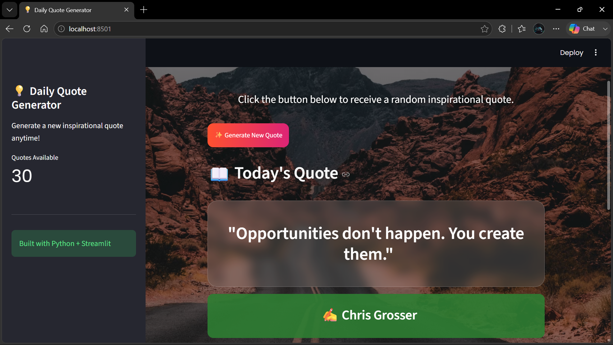

# 💡 Daily Quote Generator

A professional inspirational quote generator built using **Python** and **Streamlit**.



## 🚀 Live Demo

Try the application here:

🔗 https://daily-quote-generator-kxsedcdhlubsyktsdwjxj.streamlit.app/

---

## 🚀 Project Overview

Daily Quote Generator is an interactive web application that generates random motivational quotes and displays the quote author.

The project was built to demonstrate:

- Python programming fundamentals
- Streamlit web application development
- User interface styling with CSS
- GitHub project management
- Deployment of a Python application

---

# ✨ Features

✅ Generate random inspirational quotes

✅ Display quote authors

✅ Beautiful custom background interface

✅ Custom CSS styling

✅ Interactive Streamlit buttons

✅ Save favourite quote button

✅ Copy and share quote section

✅ Responsive web application layout

---

# 🛠️ Technologies Used

| Technology | Purpose |
|---|---|
| Python | Application logic |
| Streamlit | Web application framework |
| HTML/CSS | User interface design |
| GitHub | Version control and project hosting |

---

# 📂 Project Structure

```
Daily-Quote-generator

│
├── app.py              # Main Streamlit application
├── quotes.py           # Quote database
├── requirements.txt    # Project dependencies
├── README.md           # Project documentation
└── LICENSE             # MIT License
```

---

# ⚙️ Installation and Setup

## 1. Clone the repository

```bash
git clone https://github.com/sandilendroi-oss/Daily-Quote-generator.git
```

## 2. Navigate into the project folder

```bash
cd Daily-Quote-generator
```

## 3. Install dependencies

```bash
pip install -r requirements.txt
```

## 4. Run the application

```bash
streamlit run app.py
```

---

# 📸 Application Preview

The application provides:

- A modern background design
- Quote generation functionality
- Author information
- Interactive user interface

(Add your screenshot here)

---

# 🧠 What I Learned

Through this project I practiced:

- Writing Python applications
- Importing and managing Python modules
- Working with lists and dictionaries
- Creating interactive Streamlit components
- Applying CSS styling to improve UI design
- Managing projects using GitHub

---

# 🔮 Future Improvements

Possible future upgrades:

- Add a database for storing quotes
- Allow users to submit their own quotes
- Add user accounts
- Add categories such as:
  - Motivation
  - Success
  - Learning
  - Technology
- Add dark/light mode support

---

# 👨‍💻 Author

**Sandile Thabede**

Built with ❤️ using Python and Streamlit

---

# 📄 License

This project is licensed under the MIT License.
